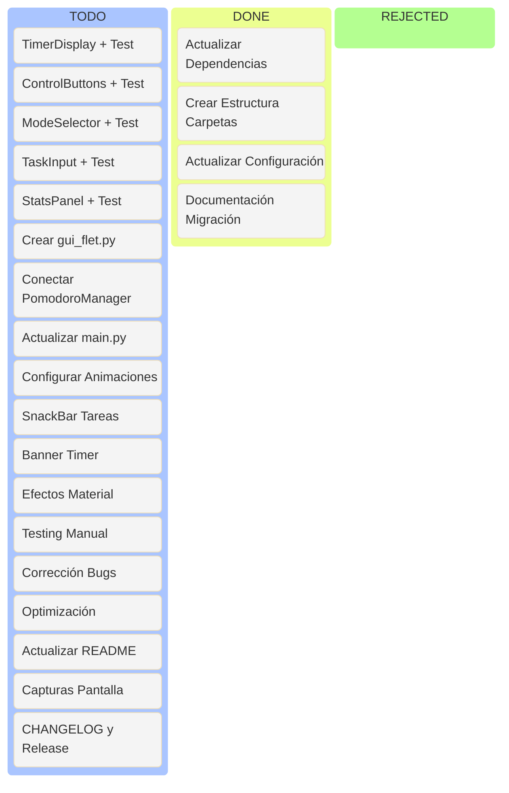

# Plan de Trabajo - Release 0.2 con Flet

## Resumen Ejecutivo

**Objetivo:** Modernizar la interfaz gráfica migrando de Tkinter a Flet (Flutter para Python).

**Duración estimada:** 17-23 horas (2.1-2.9 días)

**Framework seleccionado:** Flet 0.82.0

**Fecha de inicio:** [A definir]

**Fecha de finalización:** [A definir]

---

## Tablero Kanban - Estado de la Release



**Leyenda:**
- **Todo**: Tareas pendientes de iniciar
- **Done**: Tareas completadas (mover aquí al finalizar)
- **Rejected**: Tareas descartadas o pospuestas

---

## Fase 1: Preparación y Configuración

**Duración:** 2-3 horas

### Tareas

#### 1.1 Actualizar Dependencias
- [x] Añadir `flet==0.82.0` a requirements.txt
- [x] Instalar y verificar Flet
- [x] Documentar versiones

**Comando:**
```bash
pip install flet==0.82.0
```

#### 1.2 Crear Estructura de Carpetas
- [x] Crear carpeta `pomopy/components/`
- [x] Crear `pomopy/components/__init__.py`
- [x] Crear archivos placeholder para componentes

**Estructura:**
```
pomopy/components/
├── __init__.py
├── timer_display.py
├── control_buttons.py
├── mode_selector.py
├── task_input.py
└── stats_panel.py

tests/
├── test_timer_display.py
├── test_control_buttons.py
├── test_mode_selector.py
├── test_task_input.py
└── test_stats_panel.py
```

#### 1.3 Actualizar Configuración
- [x] Añadir sección `theme` en config.py
- [x] Añadir sección `animations` en config.py
- [x] Añadir sección `window` en config.py
- [x] Actualizar config.yaml.example
- [x] Actualizar tests de configuración

**Nuevas configuraciones en config.py:**
```python
# Tema
THEME_MODE = "dark"  # "dark" o "light"
COLOR_SEED = "blue"  # Color base Material Design

# Animaciones
ANIMATIONS_ENABLED = True
ANIMATION_DURATION = 300

# Ventana
WINDOW_WIDTH = 400
WINDOW_HEIGHT = 650
WINDOW_RESIZABLE = False
```

#### 1.4 Documentación de Migración
- [x] Crear `docs/MIGRATION_v0.2_es.md`
- [x] Documentar cambios de arquitectura
- [x] Documentar diferencias Tkinter vs Flet
- [x] Guía de actualización

### Entregables Fase 1
- ✅ requirements.txt actualizado
- ✅ Estructura components/ (carpeta y __init__.py creados)
- ✅ config.py con soporte Flet (tema, animaciones, window resizable)
- ✅ config.yaml.example actualizado
- ✅ Tests de configuración actualizados (13 tests pasando)
- ✅ MIGRATION_v0.2_es.md (completado en docs/)

### Criterios de Aceptación Fase 1
- ✅ Flet instalado sin errores
- ✅ Estructura de carpetas creada
- ✅ Config.py compila sin errores (92 tests pasando)
- ✅ Documentación completa (docs/MIGRATION_v0.2_es.md)

---

## Fase 2: Componentes Flet Base

**Duración:** 5-6 horas

**Metodología:** TDD (Test-Driven Development) - Cada componente se desarrolla junto con su test

### Tareas

#### 2.1 Implementar TimerDisplay Component + Test
- [ ] Crear `tests/test_timer_display.py` con tests básicos
- [ ] Implementar `pomopy/components/timer_display.py`
- [ ] Implementar clase TimerDisplay(ft.UserControl)
- [ ] Stack con ProgressRing y Text
- [ ] Método update_time(time_text)
- [ ] Método update_progress(percentage)
- [ ] Método set_color(color)
- [ ] Ejecutar y verificar que tests pasan
- [ ] Cobertura > 80%

**Test primero (test_timer_display.py):**
```python
import unittest
from pomopy.components.timer_display import TimerDisplay

class TestTimerDisplay(unittest.TestCase):
    def test_init(self):
        display = TimerDisplay()
        self.assertEqual(display.time_text, "25:00")
        self.assertEqual(display.progress, 0.0)
    
    def test_update_time(self):
        display = TimerDisplay()
        display.update_time("10:00")
        self.assertEqual(display.time_text, "10:00")
    
    def test_update_progress(self):
        display = TimerDisplay()
        display.update_progress(50)
        self.assertEqual(display.progress, 0.5)
    
    def test_set_color(self):
        display = TimerDisplay()
        display.set_color("#FF0000")
        self.assertEqual(display.color, "#FF0000")

if __name__ == '__main__':
    unittest.main()
```

**Implementación del componente:**
```python
import flet as ft

class TimerDisplay(ft.UserControl):
    def __init__(self):
        super().__init__()
        self.time_text = "25:00"
        self.progress = 0.0
        self.color = ft.colors.BLUE
    
    def build(self):
        self.progress_ring = ft.ProgressRing(
            value=self.progress,
            color=self.color,
            width=200,
            height=200,
            stroke_width=10
        )
        
        self.time_label = ft.Text(
            self.time_text,
            size=48,
            weight=ft.FontWeight.BOLD
        )
        
        return ft.Stack(
            [
                self.progress_ring,
                ft.Container(
                    content=self.time_label,
                    alignment=ft.alignment.center
                )
            ],
            width=200,
            height=200
        )
    
    def update_time(self, time_text):
        self.time_text = time_text
        self.time_label.value = time_text
        self.update()
    
    def update_progress(self, percentage):
        self.progress = percentage / 100.0
        self.progress_ring.value = self.progress
        self.update()
    
    def set_color(self, color):
        self.color = color
        self.progress_ring.color = color
        self.update()
```

#### 2.2 Implementar ControlButtons Component + Test
- [ ] Crear `tests/test_control_buttons.py` con tests básicos
- [ ] Implementar `pomopy/components/control_buttons.py`
- [ ] Implementar clase ControlButtons(ft.UserControl)
- [ ] Botón Start/Pause con icono
- [ ] Botón Reset con icono
- [ ] Callbacks configurables
- [ ] Ejecutar y verificar que tests pasan
- [ ] Cobertura > 80%

**Test primero (test_control_buttons.py):**
```python
import unittest
from pomopy.components.control_buttons import ControlButtons

class TestControlButtons(unittest.TestCase):
    def test_init(self):
        buttons = ControlButtons(None, None)
        self.assertFalse(buttons.is_running)
    
    def test_callback_called(self):
        called = {'start': False, 'reset': False}
        
        def on_start(e):
            called['start'] = True
        
        def on_reset(e):
            called['reset'] = True
        
        buttons = ControlButtons(on_start, on_reset)
        self.assertIsNotNone(buttons.on_start_pause)
        self.assertIsNotNone(buttons.on_reset)

if __name__ == '__main__':
    unittest.main()
```

**Implementación del componente:**
```python
import flet as ft

class ControlButtons(ft.UserControl):
    def __init__(self, on_start_pause, on_reset):
        super().__init__()
        self.on_start_pause = on_start_pause
        self.on_reset = on_reset
        self.is_running = False
    
    def build(self):
        self.start_button = ft.ElevatedButton(
            "Start",
            icon=ft.icons.PLAY_ARROW,
            on_click=self._handle_start_pause
        )
        
        self.reset_button = ft.OutlinedButton(
            "Reset",
            icon=ft.icons.REFRESH,
            on_click=self.on_reset
        )
        
        return ft.Row(
            [self.start_button, self.reset_button],
            alignment=ft.MainAxisAlignment.CENTER,
            spacing=10
        )
    
    def _handle_start_pause(self, e):
        self.is_running = not self.is_running
        self.start_button.text = "Pause" if self.is_running else "Start"
        self.start_button.icon = ft.icons.PAUSE if self.is_running else ft.icons.PLAY_ARROW
        self.update()
        if self.on_start_pause:
            self.on_start_pause(e)
```

#### 2.3 Implementar ModeSelector Component + Test
- [ ] Crear `tests/test_mode_selector.py` con tests básicos
- [ ] Implementar `pomopy/components/mode_selector.py`
- [ ] Implementar clase ModeSelector(ft.UserControl)
- [ ] Chips para Work, Short Break, Long Break
- [ ] Callback on_mode_change
- [ ] Ejecutar y verificar que tests pasan
- [ ] Cobertura > 80%

**Test primero (test_mode_selector.py):**
```python
import unittest
from pomopy.components.mode_selector import ModeSelector

class TestModeSelector(unittest.TestCase):
    def test_init(self):
        selector = ModeSelector(None)
        self.assertEqual(selector.current_mode, 'work')
    
    def test_change_mode(self):
        mode_changed = {'mode': None}
        
        def on_change(mode):
            mode_changed['mode'] = mode
        
        selector = ModeSelector(on_change)
        selector._change_mode('short_break')
        self.assertEqual(selector.current_mode, 'short_break')
        self.assertEqual(mode_changed['mode'], 'short_break')

if __name__ == '__main__':
    unittest.main()
```

**Implementación del componente:**
```python
import flet as ft

class ModeSelector(ft.UserControl):
    def __init__(self, on_mode_change):
        super().__init__()
        self.on_mode_change = on_mode_change
        self.current_mode = 'work'
    
    def build(self):
        return ft.Row(
            [
                ft.Chip(
                    label=ft.Text("Work"),
                    on_click=lambda _: self._change_mode('work')
                ),
                ft.Chip(
                    label=ft.Text("Short Break"),
                    on_click=lambda _: self._change_mode('short_break')
                ),
                ft.Chip(
                    label=ft.Text("Long Break"),
                    on_click=lambda _: self._change_mode('long_break')
                )
            ],
            alignment=ft.MainAxisAlignment.CENTER,
            wrap=True,
            spacing=5
        )
    
    def _change_mode(self, mode):
        self.current_mode = mode
        if self.on_mode_change:
            self.on_mode_change(mode)
```

#### 2.4 Implementar TaskInput Component + Test
- [ ] Crear `tests/test_task_input.py` con tests básicos
- [ ] Implementar `pomopy/components/task_input.py`
- [ ] TextField para nombre de tarea
- [ ] Botón Complete
- [ ] Callbacks configurables
- [ ] Ejecutar y verificar que tests pasan
- [ ] Cobertura > 80%

**Test primero (test_task_input.py):**
```python
import unittest
from pomopy.components.task_input import TaskInput

class TestTaskInput(unittest.TestCase):
    def test_init(self):
        task_input = TaskInput(None)
        self.assertIsNotNone(task_input.on_complete)
    
    def test_complete_callback(self):
        completed_task = {'name': None}
        
        def on_complete(task_name):
            completed_task['name'] = task_name
        
        task_input = TaskInput(on_complete)
        self.assertIsNotNone(task_input.on_complete)

if __name__ == '__main__':
    unittest.main()
```

**Implementación del componente:**
```python
import flet as ft

class TaskInput(ft.UserControl):
    def __init__(self, on_complete):
        super().__init__()
        self.on_complete = on_complete
    
    def build(self):
        self.task_field = ft.TextField(
            label="Task name",
            width=300,
            on_change=self._on_change
        )
        
        self.complete_button = ft.ElevatedButton(
            "✓ Complete",
            on_click=self._handle_complete,
            disabled=True
        )
        
        return ft.Column(
            [
                self.task_field,
                self.complete_button
            ],
            horizontal_alignment=ft.CrossAxisAlignment.CENTER,
            spacing=10
        )
    
    def _on_change(self, e):
        self.complete_button.disabled = not bool(self.task_field.value.strip())
        self.update()
    
    def _handle_complete(self, e):
        if self.on_complete:
            self.on_complete(self.task_field.value.strip())
        self.task_field.value = ""
        self.complete_button.disabled = True
        self.update()
```

#### 2.5 Implementar StatsPanel Component + Test
- [ ] Crear `tests/test_stats_panel.py` con tests básicos
- [ ] Implementar `pomopy/components/stats_panel.py`
- [ ] Mostrar pomodoros, breaks, tiempos
- [ ] Método update_stats(stats)
- [ ] Ejecutar y verificar que tests pasan
- [ ] Cobertura > 80%

**Test primero (test_stats_panel.py):**
```python
import unittest
from pomopy.components.stats_panel import StatsPanel

class TestStatsPanel(unittest.TestCase):
    def test_init(self):
        panel = StatsPanel()
        self.assertEqual(panel.stats['work'], 0)
        self.assertEqual(panel.stats['short_break'], 0)
        self.assertEqual(panel.stats['long_break'], 0)
    
    def test_update_stats(self):
        panel = StatsPanel()
        new_stats = {
            'work': 5,
            'short_break': 3,
            'long_break': 1,
            'work_time': '02:05',
            'break_time': '00:20',
            'meeting_time': '00:15:00'
        }
        panel.update_stats(new_stats)
        self.assertEqual(panel.stats['work'], 5)
        self.assertEqual(panel.stats['work_time'], '02:05')

if __name__ == '__main__':
    unittest.main()
```

**Implementación del componente:**
```python
import flet as ft

class StatsPanel(ft.UserControl):
    def __init__(self):
        super().__init__()
        self.stats = {
            'work': 0,
            'short_break': 0,
            'long_break': 0,
            'work_time': '00:00',
            'break_time': '00:00',
            'meeting_time': '00:00:00'
        }
    
    def build(self):
        return ft.Column(
            [
                ft.Text("📊 Statistics", size=16, weight=ft.FontWeight.BOLD),
                ft.Row([
                    ft.Text(f"Pomodoros: {self.stats['work']}"),
                    ft.Text(f"Work time: {self.stats['work_time']}")
                ]),
                ft.Row([
                    ft.Text(f"Short breaks: {self.stats['short_break']}"),
                    ft.Text(f"Break time: {self.stats['break_time']}")
                ]),
                ft.Row([
                    ft.Text(f"Long breaks: {self.stats['long_break']}"),
                    ft.Text(f"Meeting: {self.stats['meeting_time']}")
                ])
            ],
            spacing=5
        )
    
    def update_stats(self, stats):
        self.stats = stats
        self.update()
```

### Entregables Fase 2
- ✅ components/timer_display.py + tests/test_timer_display.py (tests pasando)
- ✅ components/control_buttons.py + tests/test_control_buttons.py (tests pasando)
- ✅ components/mode_selector.py + tests/test_mode_selector.py (tests pasando)
- ✅ components/task_input.py + tests/test_task_input.py (tests pasando)
- ✅ components/stats_panel.py + tests/test_stats_panel.py (tests pasando)
- ✅ Cobertura > 80% por componente

### Criterios de Aceptación Fase 2
- Todos los componentes funcionan independientemente
- Cada componente se desarrolla junto con su test (TDD)
- Tests pasan correctamente al finalizar cada componente
- Cobertura > 80% por componente
- Componentes son reutilizables
- Código documentado

---

## Fase 3: GUI Principal con Flet

**Duración:** 5-6 horas

### Tareas

#### 3.1 Crear gui_flet.py
- [ ] Crear `pomopy/gui_flet.py`
- [ ] Implementar clase PomodoroApp
- [ ] Integrar todos los componentes
- [ ] Configurar tema Material

**Estructura base:**
```python
import flet as ft
from pomopy.config import Config
from pomopy.pomodoro_manager import PomodoroManager
from pomopy.components.timer_display import TimerDisplay
from pomopy.components.control_buttons import ControlButtons
from pomopy.components.mode_selector import ModeSelector
from pomopy.components.task_input import TaskInput
from pomopy.components.stats_panel import StatsPanel

class PomodoroApp:
    def __init__(self, page: ft.Page, config=None):
        self.page = page
        self.config = config or Config()
        self.manager = PomodoroManager(self.config)
        self.manager.set_finish_callback(self._on_timer_finish)
        
        self._setup_page()
        self._create_components()
        self._build_layout()
    
    def _setup_page(self):
        self.page.title = "Pomodoro Timer"
        self.page.window_width = self.config.WINDOW_WIDTH
        self.page.window_height = self.config.WINDOW_HEIGHT
        self.page.window_resizable = self.config.WINDOW_RESIZABLE
        self.page.theme_mode = ft.ThemeMode.DARK if self.config.THEME_MODE == "dark" else ft.ThemeMode.LIGHT
        self.page.padding = 20
    
    def _create_components(self):
        self.timer_display = TimerDisplay()
        self.control_buttons = ControlButtons(
            on_start_pause=self.toggle_timer,
            on_reset=self.reset_timer
        )
        self.mode_selector = ModeSelector(on_mode_change=self.change_mode)
        self.task_input = TaskInput(on_complete=self.complete_task)
        self.stats_panel = StatsPanel()
        
        # Theme switch
        self.theme_switch = ft.Switch(
            label="Dark Mode",
            value=self.config.THEME_MODE == "dark",
            on_change=self._toggle_theme
        )
    
    def _build_layout(self):
        self.page.add(
            ft.Column(
                [
                    ft.Row([ft.Text("POMODORO TIMER", size=20, weight=ft.FontWeight.BOLD), self.theme_switch], alignment=ft.MainAxisAlignment.SPACE_BETWEEN),
                    ft.Divider(),
                    self.timer_display,
                    self.control_buttons,
                    ft.Divider(),
                    self.task_input,
                    ft.Divider(),
                    self.mode_selector,
                    ft.ElevatedButton("MEETING", on_click=self.toggle_meeting, width=300),
                    ft.Divider(),
                    self.stats_panel,
                    ft.Slider(min=0, max=100, value=75, label="Volume: {value}", on_change=self._on_volume_change)
                ],
                horizontal_alignment=ft.CrossAxisAlignment.CENTER,
                spacing=15
            )
        )
    
    def toggle_timer(self, e):
        # Implementar lógica
        pass
    
    def reset_timer(self, e):
        # Implementar lógica
        pass
    
    def change_mode(self, mode):
        # Implementar lógica
        pass
    
    def complete_task(self, task_name):
        # Implementar lógica
        pass
    
    def toggle_meeting(self, e):
        # Implementar lógica
        pass
    
    def _toggle_theme(self, e):
        self.page.theme_mode = ft.ThemeMode.DARK if e.control.value else ft.ThemeMode.LIGHT
        self.page.update()
    
    def _on_volume_change(self, e):
        self.manager.set_volume(e.control.value / 100.0)
    
    def _on_timer_finish(self):
        self.page.snack_bar = ft.SnackBar(ft.Text("Timer finished!"))
        self.page.snack_bar.open = True
        self.page.update()

def main(page: ft.Page):
    app = PomodoroApp(page)

if __name__ == "__main__":
    ft.app(target=main)
```

#### 3.2 Conectar con PomodoroManager
- [ ] Implementar toggle_timer()
- [ ] Implementar reset_timer()
- [ ] Implementar change_mode()
- [ ] Implementar complete_task()
- [ ] Implementar toggle_meeting()
- [ ] Implementar _tick() con timer

#### 3.3 Actualizar main.py
- [ ] Importar gui_flet
- [ ] Cambiar punto de entrada a Flet
- [ ] Mantener gui.py como fallback temporal

**main.py actualizado:**
```python
import flet as ft
from pomopy.gui_flet import main as flet_main

if __name__ == "__main__":
    ft.app(target=flet_main)
```

### Entregables Fase 3
- ✅ gui_flet.py completamente funcional
- ✅ main.py actualizado
- ✅ Funcionalidad completa mantenida
- ✅ Temas funcionando

### Criterios de Aceptación Fase 3
- Aplicación inicia sin errores
- Todos los botones funcionan
- Timer funciona correctamente
- Cambio de tema funciona
- No hay regresiones funcionales

---

## Fase 4: Animaciones y Efectos

**Duración:** 2-3 horas

### Tareas

#### 4.1 Configurar Animaciones Implícitas
- [ ] AnimatedContainer para transiciones
- [ ] AnimatedSwitcher para cambios de modo
- [ ] Duración configurable

#### 4.2 SnackBar al Completar Tareas
- [ ] Mostrar SnackBar con nombre de tarea
- [ ] Animación de entrada/salida
- [ ] Duración configurable

#### 4.3 Banner al Terminar Timer
- [ ] Banner Material al llegar a 00:00
- [ ] Acción para cerrar
- [ ] Animación de celebración

#### 4.4 Efectos Material
- [ ] Ripple effect en botones (nativo)
- [ ] Elevation en cards
- [ ] Transiciones suaves

### Entregables Fase 4
- ✅ Animaciones fluidas
- ✅ SnackBar funcionando
- ✅ Banner funcionando
- ✅ Efectos Material aplicados

### Criterios de Aceptación Fase 4
- Animaciones son fluidas (60 FPS)
- No hay lag
- Feedback visual claro
- Animaciones se pueden desactivar

---

## Fase 5: Testing y Refinamiento

**Duración:** 3-4 horas

### Tareas

#### 5.1 Verificar Suite Completa de Tests
- [ ] Ejecutar test_config.py (ya actualizado)
- [ ] Ejecutar test_timer_display.py (verificar)
- [ ] Ejecutar test_control_buttons.py (verificar)
- [ ] Ejecutar test_mode_selector.py (verificar)
- [ ] Ejecutar test_task_input.py (verificar)
- [ ] Ejecutar test_stats_panel.py (verificar)
- [ ] Crear test_gui_flet.py
- [ ] Verificar cobertura global > 85%

#### 5.2 Ejecutar Suite de Tests
- [ ] Ejecutar todos los tests
- [ ] Corregir tests fallidos
- [ ] Documentar cambios

**Comandos:**
```bash
# Tests individuales por componente
python -m tests.test_config
python -m tests.test_gui_flet
python -m tests.test_timer_display
python -m tests.test_control_buttons
python -m tests.test_mode_selector
python -m tests.test_task_input
python -m tests.test_stats_panel

# Todos los tests
python -m unittest discover -s tests -p "test_*.py"
```

#### 5.3 Testing Manual
- [ ] Probar todas las funcionalidades
- [ ] Verificar tema oscuro/claro
- [ ] Verificar animaciones
- [ ] Probar en diferentes resoluciones

#### 5.4 Optimización
- [ ] Medir tiempo de inicio
- [ ] Medir uso de memoria
- [ ] Optimizar si es necesario

#### 5.5 Validación Multiplataforma
- [ ] Probar en Windows 10/11
- [ ] Probar en Linux (si aplica)
- [ ] Documentar problemas

### Entregables Fase 5
- ✅ Tests actualizados y pasando
- ✅ Cobertura > 85%
- ✅ Bugs corregidos
- ✅ Rendimiento optimizado

### Criterios de Aceptación Fase 5
- Todos los tests pasan
- No hay bugs críticos
- Rendimiento cumple requisitos
- Aplicación estable

---

## Fase 6: Documentación y Release

**Duración:** 1-2 horas

### Tareas

#### 6.1 Actualizar README.md
- [ ] Nuevas características v0.2
- [ ] Capturas de pantalla
- [ ] Requisitos (Flet)
- [ ] Instrucciones de instalación

**Sección a añadir:**
```markdown
## Nuevas Características v0.2

- 🎨 Interfaz moderna con Flet (Flutter)
- 🌓 Material Design 3
- ⭕ ProgressRing animado
- ✨ Animaciones nativas de Flutter
- 🔔 SnackBar notifications
- 🌐 Multiplataforma (Windows, Linux, macOS, Web)
```

#### 6.2 Actualizar CONFIG.md
- [ ] Nuevas opciones de tema
- [ ] Opciones de animaciones
- [ ] Ejemplos

#### 6.3 Capturas de Pantalla
- [ ] Captura tema oscuro
- [ ] Captura tema claro
- [ ] GIF de animaciones

#### 6.4 Actualizar CHANGELOG.md
- [ ] Entrada para v0.2
- [ ] Listar características
- [ ] Listar cambios

**Formato:**
```markdown
## [0.2.0] - 2024-XX-XX

### Added
- Interfaz moderna con Flet
- Material Design 3
- ProgressRing animado
- SnackBar notifications
- Soporte multiplataforma

### Changed
- Migración de Tkinter a Flet
- Arquitectura de componentes

### Fixed
- [Lista de bugs]
```

#### 6.5 Actualizar Scripts de Build
- [ ] Actualizar build_windows.py
- [ ] Actualizar build_linux.py
- [ ] Verificar builds
- [ ] Actualizar versión a 0.2.0

### Entregables Fase 6
- ✅ README.md actualizado
- ✅ CONFIG.md actualizado
- ✅ Capturas de pantalla
- ✅ CHANGELOG.md actualizado
- ✅ Scripts de build actualizados

### Criterios de Aceptación Fase 6
- Documentación completa
- Capturas de calidad
- Release notes profesionales
- Scripts funcionando

---

## Checklist Final de Release

### Pre-Release
- [ ] Todos los tests pasan
- [ ] Documentación completa
- [ ] Capturas actualizadas
- [ ] CHANGELOG actualizado
- [ ] Versión actualizada
- [ ] Scripts de build funcionan
- [ ] No hay TODOs críticos

### Release
- [ ] Crear tag v0.2.0
- [ ] Push a GitHub
- [ ] Crear GitHub Release
- [ ] Subir binarios
- [ ] Publicar release notes

### Post-Release
- [ ] Monitorear issues
- [ ] Responder feedback
- [ ] Planificar v0.3
- [ ] Documentar lecciones aprendidas

---

## Métricas de Éxito

### Métricas Técnicas
- ✅ Cobertura > 85%
- ✅ Inicio < 2 segundos
- ✅ Memoria < 120 MB
- ✅ 0 bugs críticos
- ✅ 0 warnings

### Métricas de Calidad
- ✅ Código sigue PEP 8
- ✅ Documentación completa
- ✅ Tests pasan
- ✅ Sin código duplicado

### Métricas de Usuario
- ✅ Interfaz más atractiva
- ✅ Mejor experiencia
- ✅ Feedback visual claro
- ✅ Animaciones fluidas

---

## Notas Adicionales

### Decisiones de Diseño

1. **¿Por qué Flet?**
   - Flutter engine (rendimiento nativo)
   - Material Design 3
   - Multiplataforma
   - Animaciones nativas
   - Arquitectura moderna

2. **¿Por qué componentes separados?**
   - Reutilización
   - Mantenibilidad
   - Testing más fácil
   - Escalabilidad

3. **¿Por qué mantener gui.py temporalmente?**
   - Fallback durante migración
   - Comparación de funcionalidad
   - Eliminar en v0.3

### Recursos Útiles

- Documentación Flet: https://flet.dev/docs/
- Ejemplos Flet: https://flet.dev/docs/guides/python/getting-started
- Material Design 3: https://m3.material.io/

---

**Última actualización:** 2024-01-XX

**Estado:** En desarrollo - Fase 1 (75% completada)

**Responsable:** [Nombre/IA]
